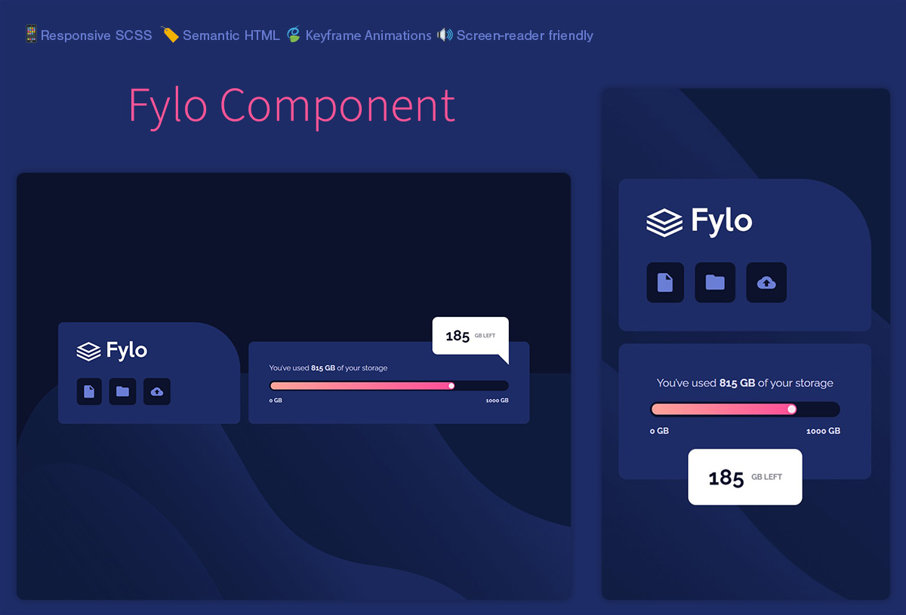

# Accessible data storage component built with HTML & SCSS partials

This is a solution to the [Fylo data storage component challenge on Frontend Mentor](https://www.frontendmentor.io/challenges/fylo-data-storage-component-1dZPRbV5n). I did not design this one (sometimes I do) I was given a JPG and a style guide with some color values.


## Table of contents

- [Overview](#overview)
  - [The challenge](#the-challenge)
  - [Screenshot](#screenshot)
  - [Links](#links)
- [My process](#my-process)
  - [Built with](#built-with)
  - [What I learned](#what-i-learned)
  - [Continued development](#continued-development)
  - [Useful resources](#useful-resources)
- [Author](#author)


## Overview

### The challenge

Users should be able to:

- View the optimal layout for the site depending on their device's screen size

### Screenshot

#### Desktop & Mobile



### Links

- Solution URL: [Codebase](https://github.com/xyeres/fylo-component)
- Live Site URL: [Live Site](https://xyeres.github.io/fylo-component/)

## My process

### Built with

- Semantic HTML5 markup
- SCSS partials with mobile-first workflow
- Flexbox
- Javascript

### What I learned

This simple component is all about the feels. Following the style guide and mockups, I learned that pixel perfect replication is important in order for the end user to experience the original designer's intention for the UI. 

SCSS Partials have continued to speed up my workflow and provide a more clean end-result: deployable code that is neither bloated nor convoluted.

One thing I'm proud of is the progress bar (thanks to CSS tricks for the base idea), a nice reusable component that is styled with the simplicity of: 

```scss
&__bar {
    align-self: stretch;
    height: 20px;
    position: relative;
    background: colors.$VeryDarkBlue;
    border-radius: 25px;
    padding: 3px;
    margin-bottom: .75rem;
  }

  &__bar>span {
    /* The gradient on the
          progress bar */
    display: block;
    height: 100%;
    border-radius: 25px;
    background-color: hsl(6, 100%, 80%);
    background-image: linear-gradient(to right, hsl(6, 100%, 80%),
        hsl(335, 100%, 65%));
    box-shadow: none;
    position: relative;
    overflow: hidden;
    transition: 750ms width ease-in;
  }

  &__bar>span::before {
    /* The white ball at 
      the front of the bar */
    content: '';
    position: absolute;
    right: 1.33px;
    top: 1.92px;
    border-radius: 50%;
    width: 10px;
    height: 10px;
    background-color: white;
    opacity: 0.85;
  }
```

Using a mobile-first approach allowed me to adapt the entire design to desktop with just a few media query overrides, such as:

```scss
@include mixins.for-tablet-portrait-up {
  body {
    background-image: url(../img/bg-desktop.png);
    background-size: 100% 50%;
    background-position: bottom right;
    background-repeat: no-repeat;
  }

  .container {
    flex-direction: row;
    align-items: flex-end;
    max-width: 1440px;
    justify-content: center;
    margin-bottom: unset;
    padding-top: 0;
    padding: 0;
  }

  .controller {
    min-width: 350px;
    max-height: 200px;
  }

  .progress {
    min-width: 540px;
    margin-top: unset;
    margin-left: 1.143rem;
    align-items: flex-start;
    padding-bottom: unset;

    &__storageLeft {
      position: absolute;
      top: -45px;
      right: 2.857rem;
      padding: 1.5rem 1.857rem;
      border-radius: vars.$BorderRadiusGlobal;
      border-bottom-right-radius: unset;
    }

    &__storageLeft::after {
      content: '';
      position: absolute;
      bottom: -20px;
      right: 0;
      height: 0;
      width: 0;
      border-top: 20px solid white;
      border-left: 20px solid transparent;
    }
  }
}
```

That is the entirity of my desktop styles. No confusing desktop to mobile and back coercion. 

### Continued development

I like adding a little movement to my UI, not overly distracting, but stuff that adds a feeling of life. I've incorporated a little keyframing on this one and an animated progress bar, but I would like to see more micro-animations in my future projects.

### Useful resources

- [CSS Tricks Progress Bars](https://css-tricks.com/css3-progress-bars/) - This was helpful in understanding how to implement the progress bar while taking into account for browser compatibility and fallback.

## Author
- Be sure to [follow me on Github!](https://www.github.com/xyeres)
- Connect with me on LinkedIn - [Michael Carr](https://www.linkedin.com/in/mxcarr/)
- Twitter - [@xyeres](https://www.twitter.com/xyeres)
